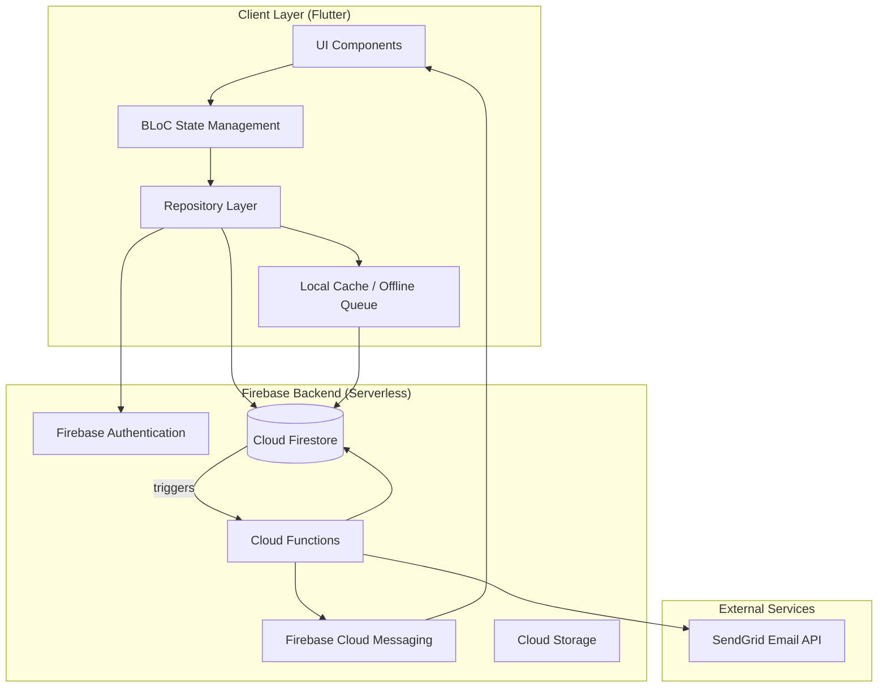
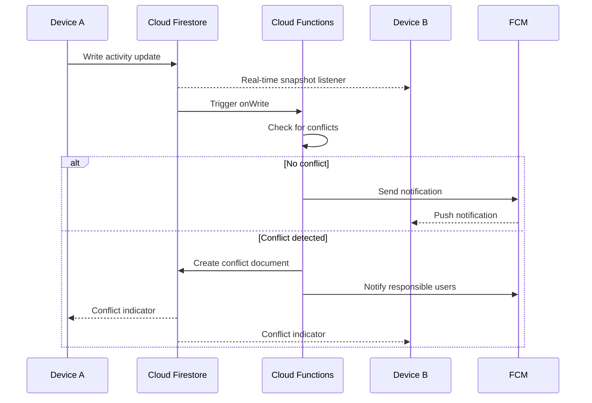
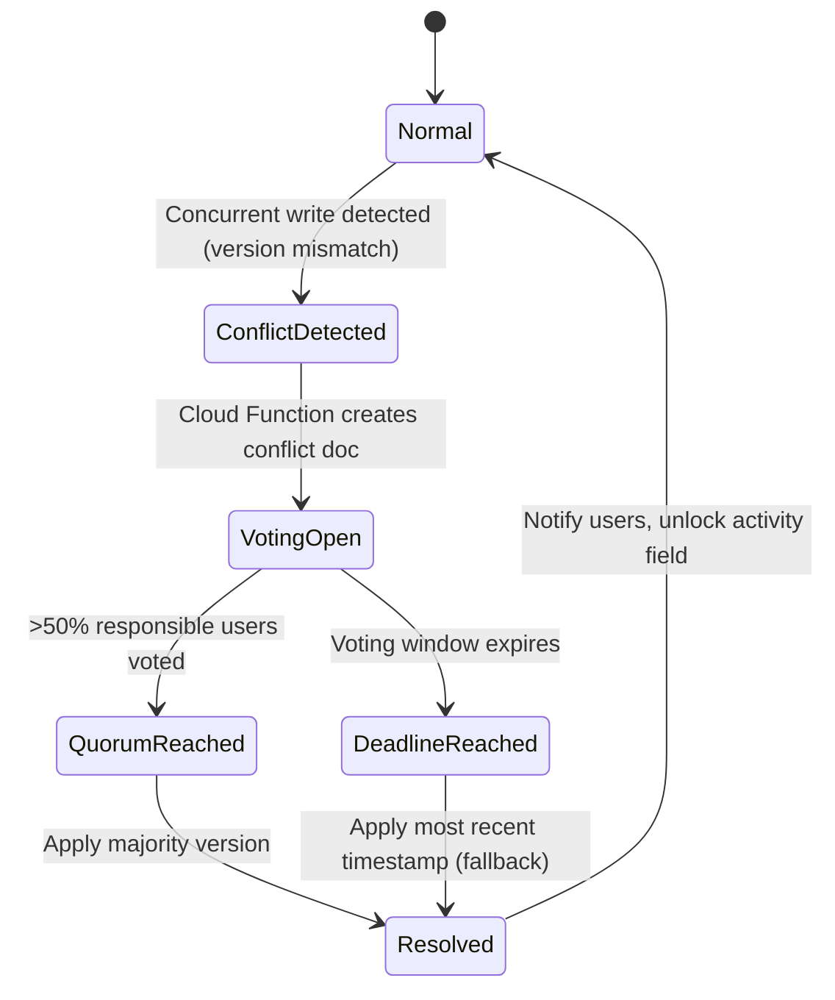

# Design Document: Activity Tracker

## Overview

Activity Tracker is a cross-platform Kanban board application built with Flutter (targeting desktop and mobile from a single codebase) backed by Firebase as the serverless infrastructure. The system enables collaborative work tracking through customizable workflow states, categorized discussions, sector-based access control, and a novel democratic conflict resolution mechanism for handling concurrent edits.

### Key Design Decisions

1. **Flutter** — Chosen for true cross-platform support (iOS, Android, Windows, macOS, Linux) from a single Dart codebase. Flutter provides native performance, rich widget ecosystem for drag-and-drop Kanban UIs, and excellent Firebase integration via FlutterFire.

2. **Firebase Firestore** — Selected as the serverless storage layer because it provides built-in real-time listeners, offline persistence with automatic sync on reconnection, automatic scaling, and multi-region replication. Firestore's document/collection model maps naturally to activities, discussions, and timelines.

3. **Firebase Cloud Functions** — Serverless compute for background tasks: email delivery (via SendGrid), notification fan-out, conflict detection, and audit logging.

4. **Firebase Cloud Messaging (FCM)** — Cross-platform push notification delivery for in-app alerts.

5. **Custom Democratic Conflict Resolution** — Built as an application-layer mechanism on top of Firestore transactions, using a dedicated `conflicts` collection and Cloud Functions to orchestrate voting windows.

---

## Architecture

### High-Level Architecture Diagram



### Layered Architecture

The application follows Clean Architecture principles with four layers:

1. **Presentation Layer** — Flutter widgets, pages, and BLoC (Business Logic Component) state managers
2. **Domain Layer** — Use cases, entities, and business rules (pure Dart, no framework dependencies)
3. **Data Layer** — Repository implementations, Firestore data sources, DTOs
4. **Infrastructure Layer** — Firebase SDK wrappers, platform-specific adapters

### Real-Time Synchronization Flow



---

## Components and Interfaces

### 1. Presentation Components

#### KanbanBoardPage
- Displays columns for each state, ordered by defined sequence
- Supports drag-and-drop for activity state transitions
- Sector filter dropdown at top
- Responsive layout: horizontal scroll on mobile, full grid on desktop

#### ActivityDetailPage
- Shows title (editable), current state, discussion section, timeline, responsible users
- Tabbed interface for Discussion / Timeline / Details

#### ConflictResolutionDialog
- Displays conflicting versions side by side
- Shows author, timestamp, and diff highlights
- Voting buttons with countdown timer

#### NotificationPanel
- In-app notification list with mark-as-read
- Badge count on app icon

### 2. Domain Layer Interfaces

```dart
// Core use cases
abstract class ActivityRepository {
  Stream<List<Activity>> watchActivitiesBySector(String sectorId);
  Future<Activity> createActivity(CreateActivityParams params);
  Future<void> updateActivity(String activityId, UpdateActivityParams params);
  Future<void> moveActivity(String activityId, String targetStateId);
  Future<Activity> getActivity(String activityId);
}

abstract class StateRepository {
  Stream<List<KanbanState>> watchStates();
  Future<KanbanState> createState(CreateStateParams params);
  Future<void> deleteState(String stateId);
}

abstract class DiscussionRepository {
  Stream<List<Post>> watchPosts(String activityId, {PostCategory? filter});
  Future<Post> createPost(String activityId, CreatePostParams params);
}

abstract class ConflictRepository {
  Stream<List<Conflict>> watchActiveConflicts(String userId);
  Future<void> castVote(String conflictId, String versionId);
}

abstract class UserRepository {
  Future<UserProfile> getProfile(String userId);
  Future<void> updateProfile(UpdateProfileParams params);
  Stream<List<Activity>> watchResponsibleActivities(String userId);
}

abstract class NotificationRepository {
  Stream<List<AppNotification>> watchNotifications(String userId);
  Future<void> markAsRead(String notificationId);
}

abstract class AccessControlRepository {
  Future<Set<Permission>> getEffectivePermissions(String userId, String sectorId);
  Future<void> grantPermission(PermissionGrant grant);
  Future<void> revokePermission(String grantId);
}
```

### 3. BLoC State Management

```dart
// KanbanBloc manages board state
class KanbanBloc extends Bloc<KanbanEvent, KanbanState> {
  // Events: LoadBoard, MoveActivity, ChangeFilter, RefreshBoard
  // States: KanbanLoading, KanbanLoaded, KanbanError
}

// ActivityBloc manages individual activity detail
class ActivityBloc extends Bloc<ActivityEvent, ActivityState> {
  // Events: LoadActivity, UpdateTitle, AddPost, WithdrawResponsibility
  // States: ActivityLoading, ActivityLoaded, ActivityError
}

// ConflictBloc manages conflict resolution UI
class ConflictBloc extends Bloc<ConflictEvent, ConflictState> {
  // Events: LoadConflicts, CastVote, DismissResolved
  // States: ConflictIdle, ConflictPending, ConflictResolved
}

// AuthBloc manages authentication state
class AuthBloc extends Bloc<AuthEvent, AuthState> {
  // Events: Login, Logout, CheckAuth
  // States: Authenticated, Unauthenticated, AuthLoading
}
```

### 4. Cloud Functions

| Function | Trigger | Purpose |
|----------|---------|---------|
| `onActivityStateChange` | Firestore onUpdate (activities) | Send notifications, detect conflicts, update timeline |
| `onPostCreated` | Firestore onCreate (posts) | Send discussion notifications, handle Ask_Help sector notifications |
| `onConflictCreated` | Firestore onCreate (conflicts) | Start voting timer, notify responsible users |
| `resolveConflict` | Scheduled / Firestore onUpdate | Check quorum, apply resolution, notify users |
| `sendEmailNotification` | Pub/Sub topic | Send email via SendGrid with retry logic |
| `cleanupProductionState` | Scheduled (daily) | Archive activities past configurable threshold |

---

## Data Models

### Firestore Collection Structure

```
/users/{userId}
  - email: string
  - nickname: string
  - sectorId: string
  - createdAt: timestamp

/sectors/{sectorId}
  - name: string
  - description: string

/states/{stateId}
  - name: string
  - order: number
  - sortOrder: "oldest_first" | "newest_first"
  - isDefault: boolean
  - productionThresholdDays: number (only for Production-type states)

/activities/{activityId}
  - title: string
  - currentStateId: string
  - sectorId: string
  - createdAt: timestamp
  - createdBy: string (userId)
  - lastModifiedAt: timestamp
  - lastModifiedBy: string (userId)
  - stateEnteredAt: timestamp
  - responsibleUsers: string[] (userIds, max 20)
  - isConflicted: boolean
  - version: number (optimistic concurrency)

/activities/{activityId}/timeline/{entryId}
  - fromStateId: string
  - toStateId: string
  - transitionedAt: timestamp
  - transitionedBy: string (userId)
  - durationMinutes: number (time spent in fromState)

/activities/{activityId}/posts/{postId}
  - content: string (1-2000 chars)
  - category: "Information" | "Complaint" | "Ask_Help"
  - authorId: string (userId)
  - createdAt: timestamp
  - targetSectors: string[] (sectorIds, only for Ask_Help, 1-10)

/conflicts/{conflictId}
  - activityId: string
  - fieldPath: string (which field is conflicted)
  - status: "pending" | "resolved"
  - createdAt: timestamp
  - votingDeadline: timestamp
  - resolvedAt: timestamp | null
  - resolutionMethod: "consensus" | "fallback" | null
  - versions: map[]
    - versionId: string
    - value: dynamic
    - authorId: string
    - modifiedAt: timestamp
  - votes: map {userId: versionId}

/notifications/{notificationId}
  - userId: string
  - type: "state_change" | "discussion" | "conflict" | "ask_help" | "conflict_resolved"
  - activityId: string
  - title: string
  - body: string
  - read: boolean
  - createdAt: timestamp

/permissions/{permissionId}
  - targetType: "user" | "sector"
  - targetId: string (userId or sectorId)
  - permissions: string[] ("View" | "Create" | "Modify" | "Move")

/emailQueue/{emailId}
  - to: string
  - subject: string
  - htmlBody: string
  - status: "pending" | "sent" | "failed"
  - attempts: number
  - lastAttemptAt: timestamp | null
  - createdAt: timestamp

/auditLog/{logId}
  - type: "conflict_created" | "vote_cast" | "conflict_resolved"
  - conflictId: string
  - activityId: string
  - userId: string | null
  - details: map
  - timestamp: timestamp
```

### Entity Definitions (Domain Layer)

```dart
class Activity {
  final String id;
  final String title;
  final String currentStateId;
  final String sectorId;
  final DateTime createdAt;
  final String createdBy;
  final DateTime lastModifiedAt;
  final String lastModifiedBy;
  final DateTime stateEnteredAt;
  final List<String> responsibleUsers;
  final bool isConflicted;
  final int version;
}

class KanbanState {
  final String id;
  final String name;
  final int order;
  final SortOrder sortOrder;
  final bool isDefault;
  final int? productionThresholdDays;
}

class Post {
  final String id;
  final String content;
  final PostCategory category;
  final String authorId;
  final DateTime createdAt;
  final List<String>? targetSectors;
}

class TimelineEntry {
  final String id;
  final String fromStateId;
  final String toStateId;
  final DateTime transitionedAt;
  final String transitionedBy;
  final int durationMinutes;
}

class Conflict {
  final String id;
  final String activityId;
  final String fieldPath;
  final ConflictStatus status;
  final DateTime createdAt;
  final DateTime votingDeadline;
  final List<ConflictVersion> versions;
  final Map<String, String> votes; // userId -> versionId
}

class UserProfile {
  final String id;
  final String email;
  final String nickname;
  final String sectorId;
}

enum PostCategory { information, complaint, askHelp }
enum SortOrder { oldestFirst, newestFirst }
enum ConflictStatus { pending, resolved }
enum Permission { view, create, modify, move }
```

### Conflict Detection and Resolution Flow



**Conflict Detection Strategy:**
- Each activity has a `version` field (optimistic concurrency control)
- Client reads current version before writing
- Firestore security rules reject writes where version doesn't match
- On rejection, client reports the conflict to a Cloud Function
- Cloud Function creates a conflict document and locks the conflicting field
- Alternatively, a scheduled function periodically scans for version mismatches in the write-ahead queue

---


## Correctness Properties

*A property is a characteristic or behavior that should hold true across all valid executions of a system — essentially, a formal statement about what the system should do. Properties serve as the bridge between human-readable specifications and machine-verifiable correctness guarantees.*

### Property 1: Title validation accepts and rejects correctly

*For any* string input, the title validation function SHALL accept the string if and only if it is non-empty, not composed entirely of whitespace, and has length between 1 and 200 characters (inclusive). All other strings SHALL be rejected.

**Validates: Requirements 1.1, 1.6, 2.2, 2.4**

### Property 2: Creator is always assigned as responsible

*For any* user creating an activity, the resulting activity's responsibleUsers list SHALL contain that user's ID.

**Validates: Requirements 1.4, 8.1**

### Property 3: Activities are grouped into correct state columns

*For any* list of activities with varying currentStateId values, the Kanban grouping function SHALL produce a mapping where each activity appears exactly once, in the column matching its currentStateId.

**Validates: Requirements 2.3**

### Property 4: Permission enforcement blocks unauthorized actions

*For any* user and any permission type (View, Create, Modify, Move), if the user's effective permissions do not include that permission type, then the corresponding action SHALL be denied and the system state SHALL remain unchanged.

**Validates: Requirements 2.5, 3.6, 9.3, 11.3, 11.4, 11.5, 11.6**

### Property 5: State transition updates current state

*For any* activity in state A and any valid target state B (where A ≠ B), after a move operation, the activity's currentStateId SHALL equal B.

**Validates: Requirements 3.1**

### Property 6: Mover auto-assignment to responsibility list

*For any* user who moves an activity and is not already in the activity's responsibleUsers list, after the move, that user SHALL appear in the responsibleUsers list.

**Validates: Requirements 3.3, 8.2**

### Property 7: No duplicate entries in responsibility list

*For any* user who moves an activity and is already in the activity's responsibleUsers list, the list length SHALL remain unchanged after the move (no duplicate created).

**Validates: Requirements 8.3**

### Property 8: Withdrawal removes user from responsibility list

*For any* activity with more than one responsible user, when a responsible user withdraws, that user SHALL no longer appear in the responsibleUsers list and the list length SHALL decrease by exactly one.

**Validates: Requirements 8.5**

### Property 9: Last responsible user cannot withdraw

*For any* activity with exactly one responsible user, a withdrawal request from that user SHALL be rejected and the responsibleUsers list SHALL remain unchanged.

**Validates: Requirements 8.6**

### Property 10: State name validation and case-insensitive uniqueness

*For any* state name between 1 and 50 characters, creation SHALL succeed if no existing state has a case-insensitive match. *For any* state name that matches an existing state name (case-insensitive), creation SHALL be rejected.

**Validates: Requirements 4.2, 4.3**

### Property 11: State-specific activity sorting and threshold filtering

*For any* list of activities within a state, the sort function SHALL order activities according to the state's configured sort order (oldest-first or newest-first by stateEnteredAt). Additionally, for Production-type states, *for any* threshold value T, the filter SHALL exclude activities whose stateEnteredAt is older than T days from the current time.

**Validates: Requirements 4.5, 4.6, 4.7**

### Property 12: Duration calculation with minute-level floor precision

*For any* two UTC timestamps (entry and exit) where exit > entry, the calculated duration SHALL equal floor((exit - entry) / 60 seconds), expressed in minutes.

**Validates: Requirements 5.1, 5.3**

### Property 13: Cumulative time aggregation per state

*For any* activity with a list of timeline entries, the cumulative time for each state SHALL equal the sum of all durationMinutes values for entries whose fromStateId matches that state.

**Validates: Requirements 5.2**

### Property 14: Post content validation

*For any* post submission, the system SHALL accept if and only if the content is non-empty (between 1 and 2000 characters) and a valid category (Information, Complaint, or Ask_Help) is selected.

**Validates: Requirements 6.2, 6.6**

### Property 15: Ask_Help post requires 1 to 10 target sectors

*For any* post with category Ask_Help, the system SHALL accept if and only if targetSectors contains between 1 and 10 sector IDs (inclusive).

**Validates: Requirements 6.4, 6.8**

### Property 16: Discussion category filtering returns only matching posts

*For any* list of posts and any category filter value, the filtered result SHALL contain only posts whose category matches the filter, and SHALL contain all posts matching that category from the original list.

**Validates: Requirements 6.7**

### Property 17: User profile field validation

*For any* user registration input, the system SHALL accept if and only if the email is a valid format (max 254 characters), the nickname is between 1 and 50 characters, and a sector is specified.

**Validates: Requirements 7.1**

### Property 18: Email uniqueness enforcement (case-insensitive)

*For any* email address that already exists in the system (case-insensitive comparison), a registration or update attempt using a case-variant of that email SHALL be rejected.

**Validates: Requirements 7.2, 7.6**

### Property 19: Notification recipients exclude the acting user

*For any* action (state change or post creation) performed by a user, the notification recipient list SHALL equal the set of responsible users for that activity minus the acting user.

**Validates: Requirements 10.1, 10.2, 10.3**

### Property 20: Notification content completeness and truncation

*For any* state-change notification, the content SHALL include the activity title, previous state, new state, and acting user name. *For any* discussion notification, the content SHALL include the activity title, post content truncated to a maximum of 200 characters, and author name.

**Validates: Requirements 10.4, 10.5**

### Property 21: User-level permissions take precedence over sector-level

*For any* user who has both user-level and sector-level permissions defined, the effective permission set SHALL equal the user-level permissions, ignoring sector-level grants.

**Validates: Requirements 11.2**

### Property 22: Permission revocation rejected when it eliminates last admin

*For any* permission change that would result in zero users holding all four permissions (View, Create, Modify, Move), the change SHALL be rejected.

**Validates: Requirements 11.7**

### Property 23: Each user may cast exactly one vote per conflict

*For any* conflict and any user who has already cast a vote, a second vote attempt SHALL be rejected and the existing vote SHALL remain unchanged.

**Validates: Requirements 13.6**

### Property 24: Conflict resolution applies majority with timestamp fallback

*For any* conflict with votes cast, resolution SHALL apply the version with the highest vote count. If no votes are cast, resolution SHALL apply the version with the most recent modification timestamp. If two or more versions are tied in votes, resolution SHALL apply the tied version with the most recent modification timestamp.

**Validates: Requirements 13.7, 13.8, 13.9**

### Property 25: Conflicted activity fields are locked from modification

*For any* activity with an active conflict (isConflicted = true), modification attempts to the conflicting field SHALL be rejected until the conflict is resolved.

**Validates: Requirements 13.10**

---

## Error Handling

### Client-Side Error Handling

| Error Type | Handling Strategy |
|------------|------------------|
| Network timeout | Show offline indicator, queue writes locally, retry on reconnection |
| Validation failure | Display inline error message next to the offending field, preserve user input |
| Permission denied | Show authorization error toast, redirect to allowed view |
| Conflict detected | Show conflict indicator on activity, open resolution dialog |
| Firestore quota exceeded | Show "service temporarily unavailable" message, exponential backoff retry |

### Server-Side Error Handling (Cloud Functions)

| Error Type | Handling Strategy |
|------------|------------------|
| Email delivery failure | Retry up to 3 times with 1-minute intervals, log failure after exhaustion |
| FCM delivery failure | Log error, mark notification as failed, do not retry (FCM handles redelivery) |
| Conflict resolution timeout | Apply timestamp-based fallback resolution |
| Concurrent function invocation | Use Firestore transactions for atomic operations |
| Invalid data in trigger | Log error with full context, skip processing, alert admin |

### Offline Behavior

- All read operations fall back to local Firestore cache
- Write operations are queued locally and synced on reconnection
- Conflict detection runs after sync completes
- Users see a visual indicator when working offline
- Pending writes show optimistic UI updates with a "syncing" badge

### Error Codes

```dart
enum ActivityTrackerError {
  titleRequired,        // Empty or whitespace-only title
  titleTooLong,         // Title exceeds 200 characters
  stateLimitReached,    // Attempting to create 11th state
  stateNameDuplicate,   // Case-insensitive duplicate state name
  permissionDenied,     // User lacks required permission
  withdrawalBlocked,    // Last responsible user cannot withdraw
  responsibilityLimit,  // Activity already has 20 responsible users
  conflictInProgress,   // Field is locked due to pending conflict
  alreadyVoted,         // User already voted on this conflict
  votingWindowClosed,   // Voting deadline has passed
  emailInvalid,         // Email format validation failed
  emailDuplicate,       // Email already registered
  sectorRequired,       // Ask_Help post missing target sectors
  postContentRequired,  // Post content empty or category missing
  adminSafetyViolation, // Would remove last full-admin user
}
```

---

## Testing Strategy

### Property-Based Testing

**Library:** [fast_check](https://pub.dev/packages/fast_check) for Dart/Flutter property-based testing.

**Configuration:**
- Minimum 100 iterations per property test
- Each property test tagged with: `Feature: activity-tracker, Property {N}: {description}`
- Generators for: valid titles, invalid titles, user profiles, activity lists, permission sets, conflict scenarios, vote distributions

**Property tests cover:**
- All 25 correctness properties defined above
- Focus on pure domain logic (validation, sorting, filtering, resolution algorithms)
- No external dependencies in property tests (mock repositories)

### Unit Testing

Unit tests complement property tests for:
- Specific edge cases: exactly 10 states (limit), exactly 20 responsible users (limit)
- Default state initialization (Backlog, Development, Production)
- Timestamp recording precision
- BLoC state transitions (Loading → Loaded → Error flows)
- DTO serialization/deserialization

### Integration Testing

Integration tests verify:
- Firestore read/write operations with real emulator
- Cloud Function triggers (state change → notification creation)
- Email queue processing with SendGrid mock
- FCM notification delivery
- Offline → online sync behavior
- Conflict detection across multiple concurrent writes
- Permission enforcement end-to-end

### End-to-End Testing

E2E tests using Flutter integration test framework:
- Full activity lifecycle: create → move → discuss → resolve conflict
- Cross-device sync scenario (simulated)
- Permission flow: admin grants permission → user performs action
- Sector filtering and switching

### Test Infrastructure

```
tests/
├── unit/
│   ├── domain/
│   │   ├── validators/        # Title, post, user validators
│   │   ├── use_cases/         # Business logic use cases
│   │   └── entities/          # Entity behavior tests
│   └── presentation/
│       └── blocs/             # BLoC state machine tests
├── property/
│   ├── title_validation_test.dart
│   ├── state_sorting_test.dart
│   ├── permission_enforcement_test.dart
│   ├── conflict_resolution_test.dart
│   ├── responsibility_management_test.dart
│   ├── notification_recipients_test.dart
│   └── duration_calculation_test.dart
├── integration/
│   ├── firestore/             # Firestore emulator tests
│   ├── functions/             # Cloud Functions tests
│   └── sync/                  # Real-time sync tests
└── e2e/
    └── flows/                 # Full user journey tests
```
